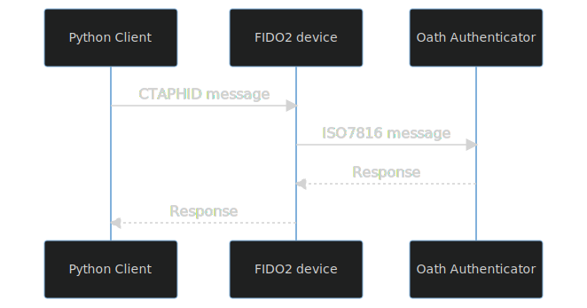
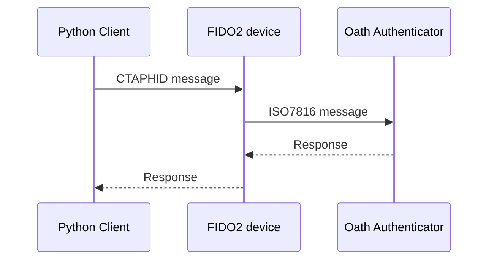
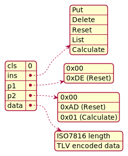
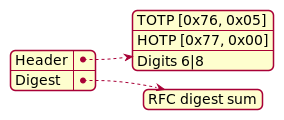
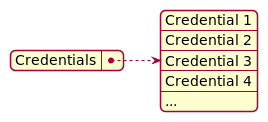

# Oath Authenticator Client

The [Oath Authenticator] application has been chosen as a good candidate due to being written in an extensive way, and
offered in the same language as the platform, thus guaranteeing high compatibility and maintainability.

It offers HOTP and TOTP implementations ([RFC4226] and [RFC6238] respectively), with SHA1 and SHA256 hashes support. It
manages to process 320+ bits of the shared key.

The protocol it uses - [YKOATH] - is using [ISO7816-4] commands for communication.

[RFC6238]: https://www.rfc-editor.org/rfc/rfc6238

[Oath Authenticator]: https://github.com/trussed-dev/oath-authenticator

[YKOATH]: https://developers.yubico.com/OATH/YKOATH_Protocol.html

## Protocol Description

This implementation uses CTAPHID to transfer commands to the Oath Authenticator application, compiled into the Nitrokey
3 firmware. This transport was used to improve compatibility on platforms, where the default transport for this
application, CCID, is not easily available (e.g. due to being taken by other services, or requiring Administrator
privileges). In CTAPHID, a custom vendor command number was selected `0x70`, thus allowing for a compatible extension of
any FIDO device.

Below is a visualization of getting the OTP code from the device. First the ISO7816 message is created and encapsulated
into CTAPHID message, which is unpacked on the device and passed further to the Oath Authenticator. Once parsed and
processed, the response is produced, which traverses the same way backwards, finally reaching Python client over
CTAPHID.

 <!--  -->


Following commands are accepted by the Oath Authenticator:

| Command   | Cls  | Ins  | P1     | P2   | Description                              |
|-----------|------|------|--------|------|------------------------------------------|
| Put       | 0x00 | 0x01 | 0x00   | 0x00 | Register a new OTP credential            |
| Delete    | 0x00 | 0x02 | 0x00   | 0x00 | Delete a registered OTP credential       |
| Reset     | 0x00 | 0x04 | 0xDE   | 0xAD | Remove all stored OTP credentials        |
| List      | 0x00 | 0xA1 | 0x00   | 0x00 | List stored OTP credentials              |
| Calculate | 0x00 | 0xA2 | 0x00   | 0x01 | Calculate an OTP code for the credential |

This is a standard ISO7816 encoding of the command and its parameters. The P1 and P2 are mostly unused, except for the
case of Reset and Calculate commands. The class `cls` parameter is always `0`.

Same table, but graphically:




## Commands

### Put

#### Input

| Command   | Cls  | Ins  | P1     | P2   | Description                              |
|-----------|------|------|--------|------|------------------------------------------|
| Put       | 0x00 | 0x01 | 0x00   | 0x00 | Register a new OTP credential            |

| Parameters     | Type   | Description                                                                                |
|----------------|--------|--------------------------------------------------------------------------------------------|
| CredentialId   | Bytes  | The credential name, stored for the later reference and listing                            |
| Key            | Bytes  | The shared key in raw bytes                                                                |
| Type*          | u8     | OtpKind "bitwiseOr" Hash algorithm. Values are described below. Prefixed to the Key field. |
| Digits*        | u8     | Digits count. The common values are `6` and `8`. Prefixed to the Key field.                |
| InitialCounter | u32 BE | Initial value for the HOTP counter, encoded in big endian.                                 |

Fields marked with `*` are concatenated with the `Key` field.

| Tag            | Value | Description                                                                                 |
|----------------|-------|---------------------------------------------------------------------------------------------|
| CredentialId   | 0x71  | The credential name, stored for the later reference and listing                             |
| Key            | 0x73  | \[ OtpKind bitwiseOr HashAlgorithm, digits, shared key \]                                   |
| Challenge      | 0x74  | The challenge value for the TOTP calculations. 64-bit unsigned integer, big endian encoded. |
| InitialCounter | 0x7A  | Initial value for the HOTP counter. 32-bit unsigned integer, big endian encoded.            |

| Kind         | Value | Description                                               |
|--------------|-------|-----------------------------------------------------------|
| HOTP         | 0x10  | Calculate OTP as HOTP, against the internal counter       |
| TOTP         | 0x20  | Calculate OTP as TOTP, against the provided challenge     |
| REVERSE_HOTP | 0x30  | Calculate HOTP code, and compare against the provided one |

| Algorithm | Value | Description               |
|-----------|-------|---------------------------|
| Sha1      | 0x01  | Use SHA1 hash algorithm   |
| Sha256    | 0x02  | Use SHA256 hash algorithm |

#### Response

None

### Calculate

#### Input

| Command   | Cls  | Ins  | P1     | P2   | Description                              |
|-----------|------|------|--------|------|------------------------------------------|
| Calculate | 0x00 | 0xA2 | 0x00   | 0x01 | Calculate an OTP code for the credential |

| Parameters   | Type   | Description                                                     |
|--------------|--------|-----------------------------------------------------------------|
| CredentialId | Bytes  | The credential name, stored for the later reference and listing |
| Challenge    | u64 BE | The challenge value to run calculation against                  |

Fields marked with `*` are concatenated with the `Key` field.

#### Response




The received digest is calculated according to the [RFC4226] specification. This means it has to be processed further to
obtain the target OTP code as follows:

```python
# digits - user provided value during registration for selecting the final code length
# digest - calculated hash some, received from the device
truncated_code = int.from_bytes(digest, byteorder="big", signed=False)
code = (truncated_code & 0x7FFFFFFF) % pow(10, digits)
code_string = str(code).zfill(digits)
```

[RFC4226]: https://www.rfc-editor.org/rfc/rfc4226

[ctap-vendor]: https://fidoalliance.org/specs/fido-v2.0-id-20180227/fido-client-to-authenticator-protocol-v2.0-id-20180227.html#usb-vendor-specific-commands

[ISO7816]: https://www.iso.org/standard/54550.html

[ISO7816-4]: https://www.iso.org/standard/54550.html

### List

List command returns a TLV encoded list of binary strings:





### Delete

| Command   | Cls  | Ins  | P1     | P2   | Description                              |
|-----------|------|------|--------|------|------------------------------------------|
| Delete    | 0x00 | 0x02 | 0x00   | 0x00 | Delete a registered OTP credential       |

#### Input

| Parameters   | Type  | Description                                                     |
|--------------|-------|-----------------------------------------------------------------|
| CredentialId | Bytes | The credential name, stored for the later reference and listing |

#### Response

None

## Tests

The tests for communication and responses correctness according to the RFC test vectors are provided in `test_otp.py`
file.

These can be run against a USB/IP device simulation of Nitrokey 3.

## Client Application

The Oath Authenticator can be reached through the described protocol over a pynitrokey CLI experimental interface. Excerpt from its help screen follows:

```text
$ nitropy nk3 otp
Command line tool to interact with Nitrokey devices 0.4.30
Usage: nitropy nk3 otp [OPTIONS] COMMAND [ARGS]...

  Manage OTP secrets on the device.

Options:
  --help  Show this message and exit.

Commands:
  get       Generate OTP code from registered credential.
  register  Register OTP credential.
  remove    Remove OTP credential.
  reset     Remove all OTP credentials from the device.
  show      List registered OTP credentials.

$ nitropy nk3 otp register --help
Command line tool to interact with Nitrokey devices 0.4.30
Usage: nitropy nk3 otp register [OPTIONS] NAME SECRET

  Register OTP credential.

  Write SECRET under the NAME. SECRET should be encoded in base32 format.

Options:
  --digits_str [6|8]       Digits count
  --kind [TOTP|HOTP]       OTP mechanism to use
  --hash [SHA1|SHA256]     Hash algorithm to use
  --counter_start INTEGER  Starting value for the counter (HOTP only)
  --help                   Show this message and exit.

$ nitropy nk3 otp get --help
Command line tool to interact with Nitrokey devices 0.4.30
Usage: nitropy nk3 otp get [OPTIONS] NAME

  Generate OTP code from registered credential.

Options:
  --timestamp INTEGER  The timestamp to use instead of the local time (TOTP
                       only)
  --period INTEGER     The period to use in seconds (TOTP only)
  --help               Show this message and exit.
```


## Further development

Current solution does have a couple of limitations, which could be corrected in the further development:

- initial HOTP counter value can't be bigger than 2^32;
- SHA512 algorithm is not supported at the moment.

Both limitations are not affecting the daily usage.


## Funding

[](https://nlnet.nl/)
[](https://nlnet.nl/NGI0/)

Changes in this project were funded through the [NGI0 PET](https://nlnet.nl/PET) Fund, a fund established by [NLnet](https://nlnet.nl/) with financial support from the European Commission's [Next Generation Internet programme](https://ngi.eu/), under the aegis of DG Communications Networks, Content and Technology under grant agreement No 825310.
